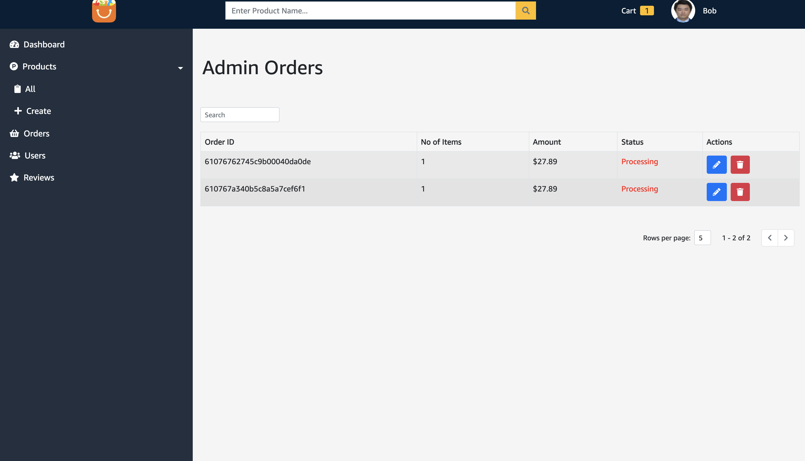

# E-Commercial Single Page Web Application
> This project is a full functionality E-Commercial web app like Amazon with frontend part implemented in React/Redux and backend part in express framework that provides 24 RESTFUL APIs to process HTTP request.
> User, Product and Order data are stored in MongoDB. User Avatar and product images are hosted in Cloudinary, and with the help of Stripe to achieve payment method and payment information can be got from Stripe.
> Implemented the functionality including post/update/delete product, browse products (with filter, search, and pagination)/product details, add/list/delete reviews for product part.
> Users could register, login, logout, forget password(mailTrap), reset password, change password and update profile while admins could also get users list and user information.
> Users could place order, get order details, their orders while admins can get all orders, delete order and update order status.
> This Web App is deployed on Heroku(https://e-commercial-tianao.herokuapp.com/), and it is responsive on small width devices such like IphoneX and Iphone8P.

# ChatApp
•	This project is a chat web app like messenger achieving real-time text chat, reaction and video chat

## Table of contents
* [General info](#General-info)
* [Technologies](#Technologies)
* [Setup](#Setup)


## General-info
1. Home Page.
<p align="center">

<p>
2. Product Detail.
<p align="center">

<p>
3. Customer Reviews.
<p align="center">

<p>
4. Shopping Cart.
<p align="center">

<p>
5. Shipping Info.
<p align="center">

<p>
6. Confirm order.
<p align="center">

<p>
7. Payment.
<p align="center">

<p>
8. Orders.
<p align="center">

<p>
9. Order Detail.
<p align="center">

<p>
10. User Profile.
<p align="center">

<p>
11. Edit User Profile.
<p align="center">

<p>
12. Dashboard.
<p align="center">

<p>
13. Product List.
<p align="center">

<p>
14. Edit Product.
<p align="center">

<p>
15. Create Product.
<p align="center">

<p>
16. Admin Orders.
<p align="center">

<p>
17. User List.
<p align="center">

<p>
18. Admin Reviews.
<p align="center">

<p>


## Technologies
Project is created with:
* React/Redux
* Express
* MongoDB, Mongoose
* Cloudinary
* Stripe
* mailTrap
* Heroku

### Frontend
```
cd frontend
npm i
npm start

```
### Backend
```
npm i
npm run seeder to seed the database
npm run dev
```
